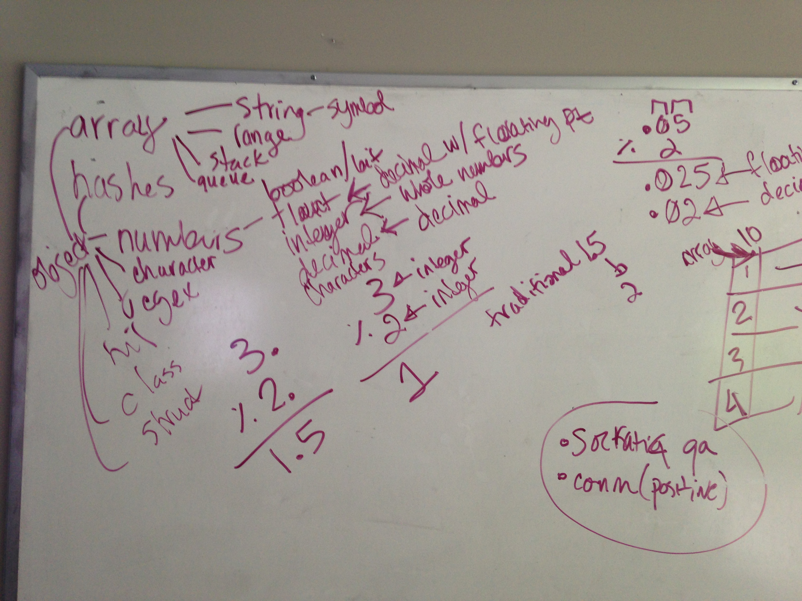

# Introduction to Data Structures

Data Structures, as the name implies, are the structures in which data is stored.

Data is, losely, anything that can be stored.

The structures can be in a multitude of forms, but the primary forms are lists (think to-do lists, people waiting in lines, or a class roster), hashes (think dictionaries, thesauruses, or anything else where you can look up one item in order to find more and/or related information), trees (think org charts and family trees), and objectsc (a collection of information about a single concept/thing).

Objects are the most nebulous concept in that list but for now, you can think of them as "the data structure that can hold anything".  

Each of those basic data structures can hold data of basically any type.

The types of data that can be stored are near limitless, but at their heart each data type boils down to either: numbers (e.g. decimals and integers), letters (e.g. characters or strings), true/false values (e.g. plain-ol-1s-and-0s or booleans), or nothing (e.g. nil or null).

The concept of "nothing", which is typically called nil or null, depending on the language, is a unique one.  nil is similar to the number 0, which represents a non-quantity.  nil can be thought of as the non-object.  We use it when we want to indicate that something is literally not present, rather than something that is empty.

## How Data Types and Data Structures are related:

### Cohort 3 Example:

### Cohort 4 Example:

