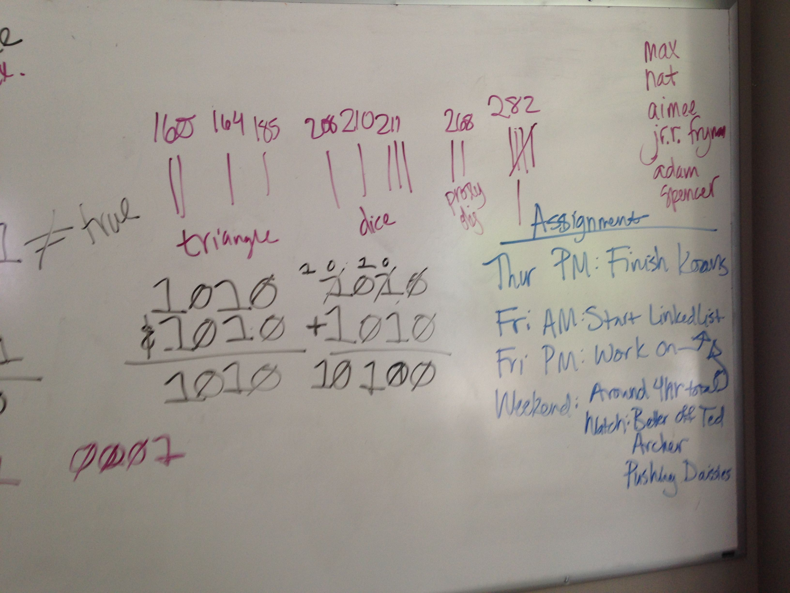
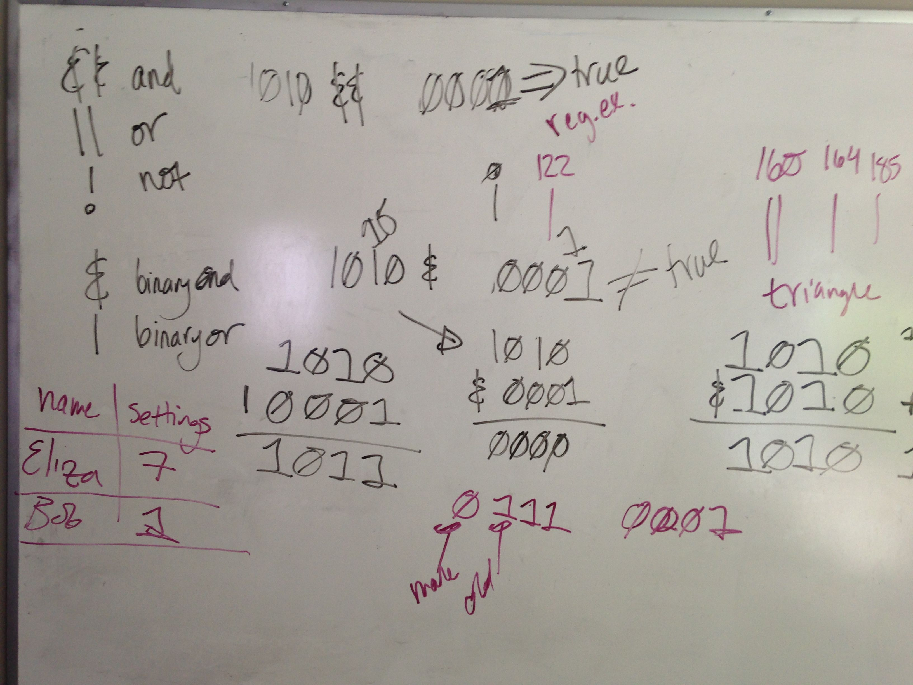
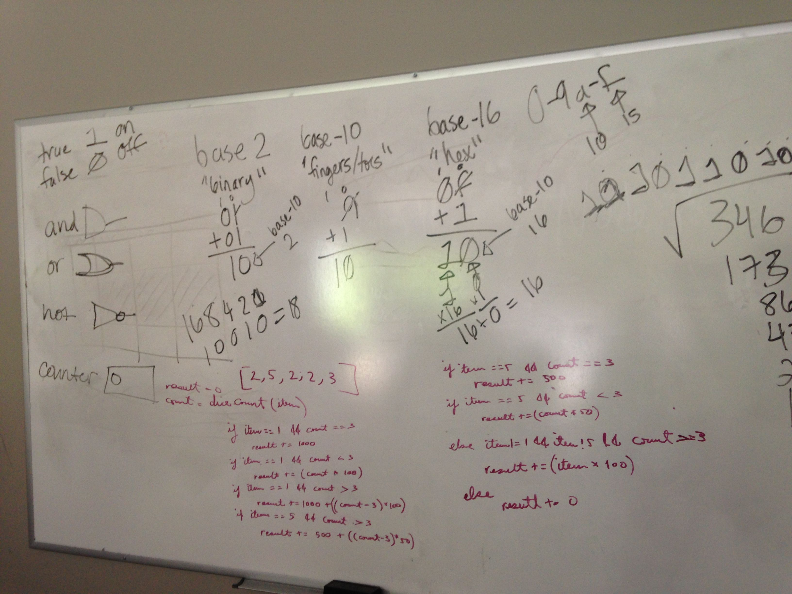
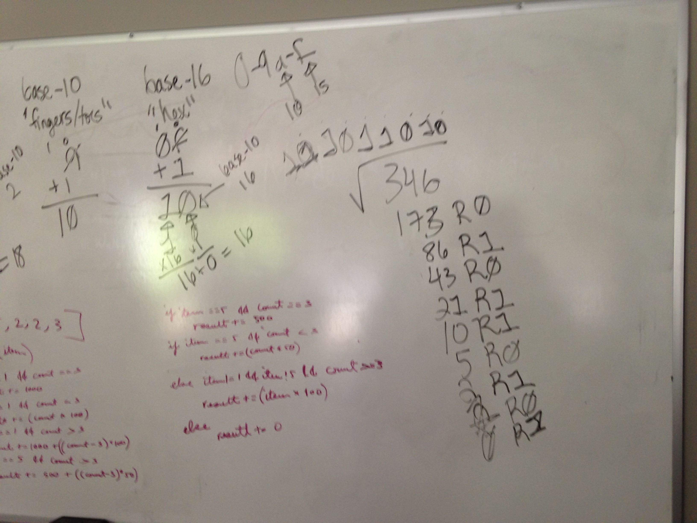

# Mathematics for Computer Science

## Base 10 Math

* Standard Algebra
* Modulus

## Base 2 (Binary) Math

* Counting
* Addition
* Subtraction
* Multiplication (ties into architecture discussion..)
* &
* |
* Converting to Base-10

## Base 16 (Hex) Math

Same basics as above, but with 0-9A-F

## Base 8 (Octal) Math

You aren't going to run into this too often.
Same basics as above, but with 0-8

## Advanced Maths

Jeremy Kun has a number of primers on Computer Science-related topics at: [http://jeremykun.com/primers/](http://jeremykun.com/primers/).  They include such topics as:  Methods of Proof (e.g. logic proofs), Abstract and Linear Algebra, Fourier Analysis, Discrete Math and Computing Theory.

## Examples from Cohort 4:

