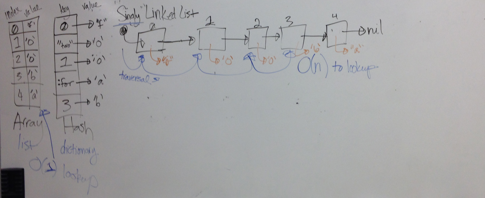
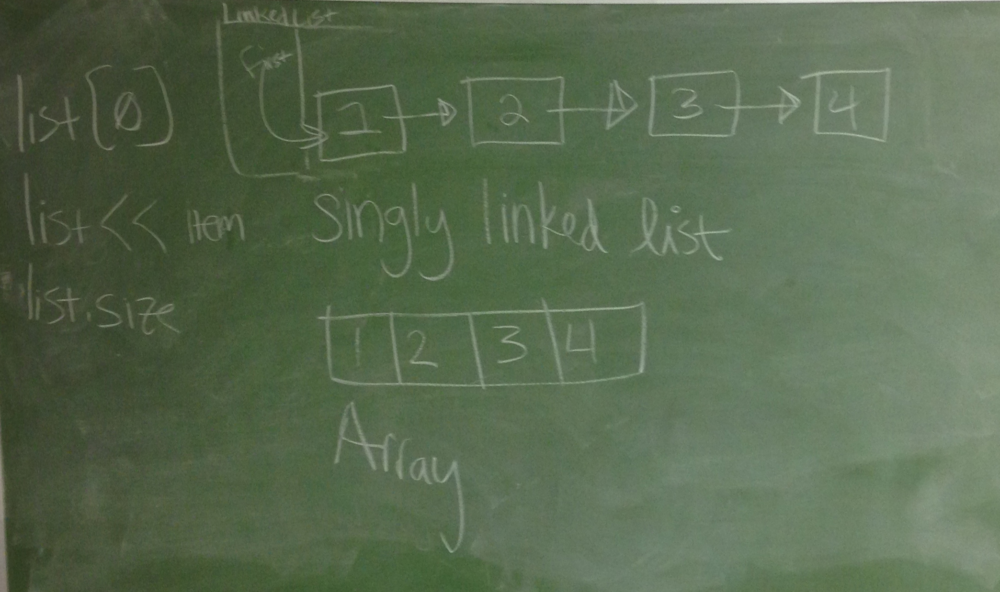
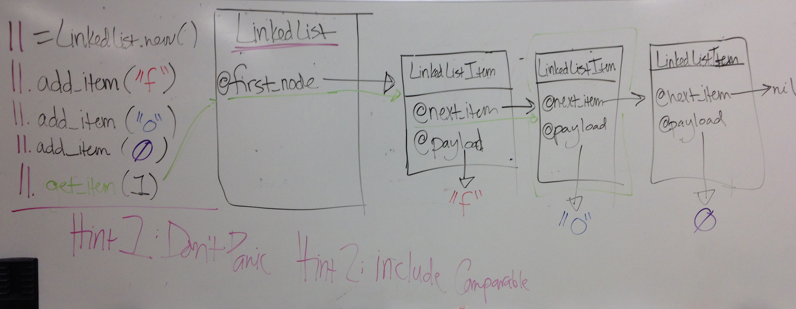
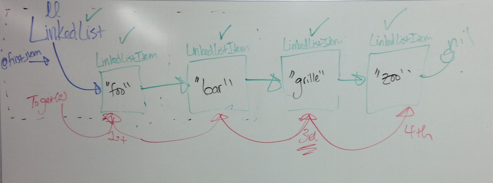
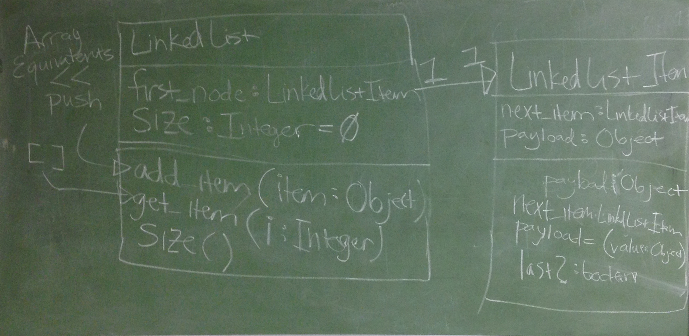
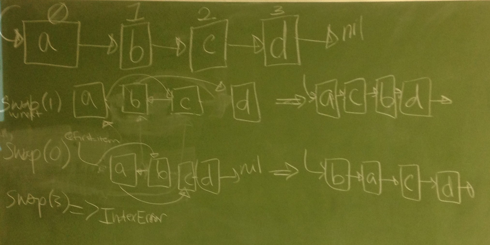
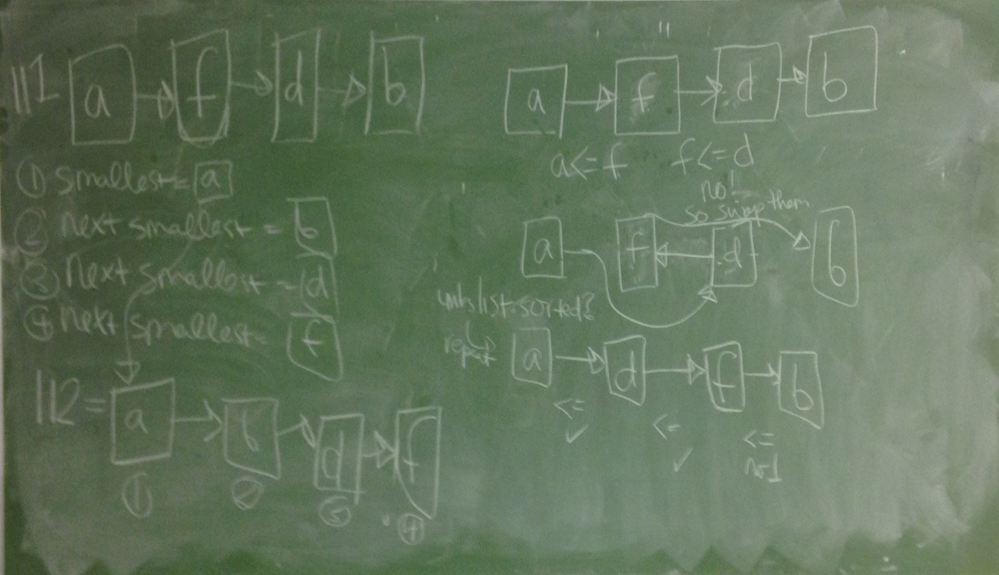

# Linked Lists

Instructions
-----------

  1. Read about unit testing at the following links:
    * http://en.wikipedia.org/wiki/Test-driven_development
    * http://www.extremeprogramming.org/rules/unittests.html
  2. Fork this repository and clone your fork
  3. cd into the linked-list-cohort3 folder on your computer
  4. Run `rake` to run the test suite
  5. Make the test suite pass by implementing the LinkedList and LinkedListItem classes
    * Choose one test at a time to work on
    * Once the tests pass, you should refactor and clean up your code
  6. Push your implementation up to github as you work on it.

More Information
----------------

The tests for the project are in the /tests directory.

The stubbed classes that you are to implement are in the /lib directory.

I have numbered the unit tests to give you a hint at the easiest implementation order.

Caveats
-------

* Don't use hashes
* Don't use arrays
* Only use core Ruby (e.g. No `require`s)
* No copying (from the internet or your peers)

Images of Notes
---------------

These images are of notes taken during other classes.  They may be helpful:

Array vs. Hash vs. LinkedList:

Singly Linked List:

Add Item to Linked List:

Get a LinkedListItem:

Class Diagram of LinkedList:

Sorting LinkedLists In-Place:

Sorting In-Place vs. Sorting into a new LinkedList:

## Milestone 1: Tests through sorted

Implement Linked Lists through the tests for sorted.

## Milestone 2: Sorting

Implement sorting

## Milestone 3: Completed Tests

All tests should be passing at this point
